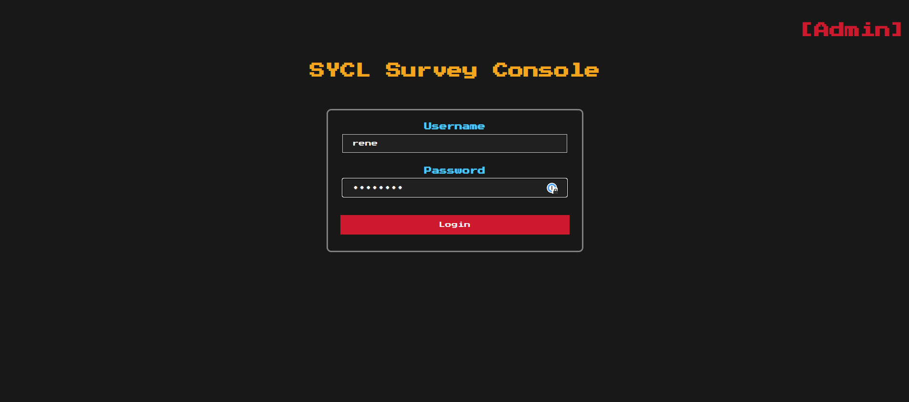
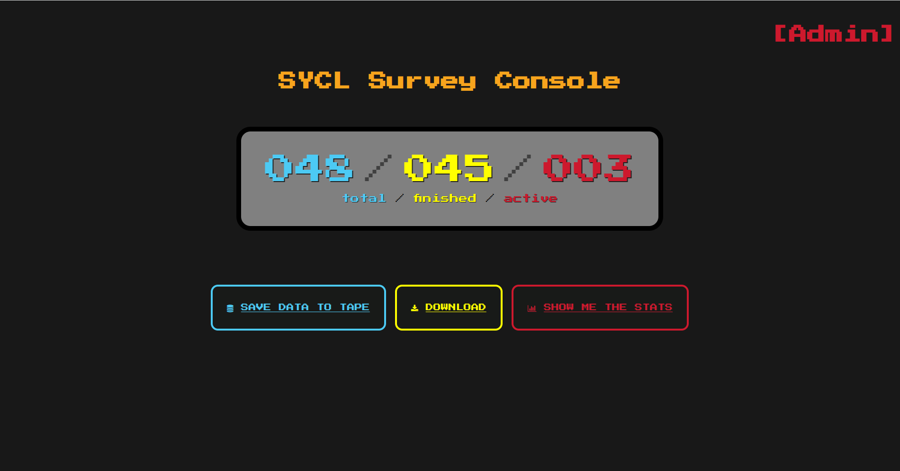
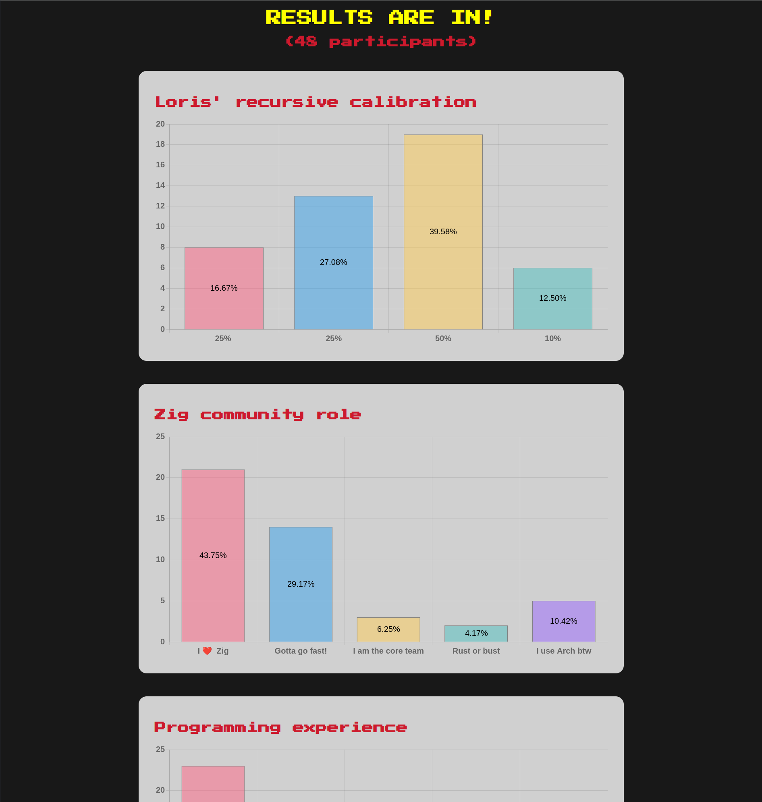

# SYCL 2023 Demo App

This is the demo survey app I used at the [SYCL
2023](https://softwareyoucanlove.ca) conference in Vancouver.

It is provided as is. Some of it, especially the CSS situation of the admin
frontend, is a mess.

**NOTE** The app won't start without a `passwords.txt` file present in its cwd.
For that reason, I've provided one. 

# The admin console

If you go to http://localhost:5000/admin/, you can use `demo` as username and
password.

The meaning of the buttons is as follows:

- SAVE DATA TO TAPE: will make the server save the state of all participants
  into a file `participants.timestamp.json`.
- DOWNLOAD: lets you download the state of all participants in JSON format to
  your local machine.
- SHOW ME THE STATS: will show the results

